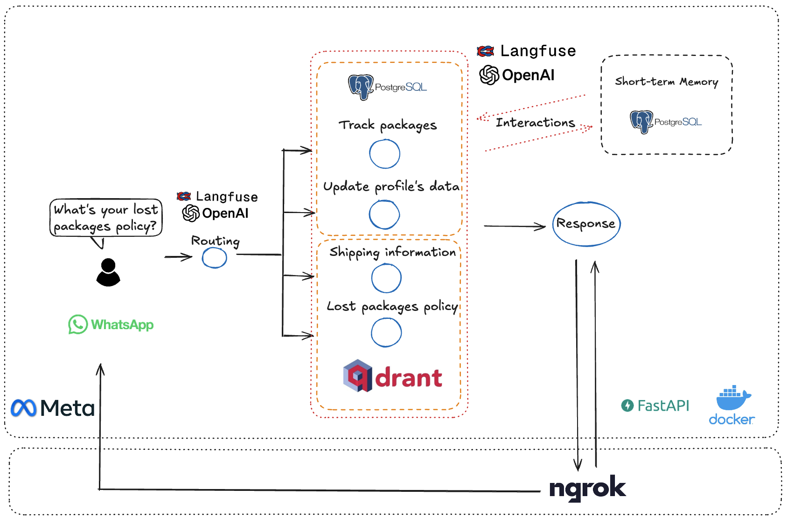

# Building an AI Agentic Workflow for Postal Services with WhatsApp, PostgreSQL, Qdrant, Langfuse, FastAPI

## 📌 Overview
Postal services handle countless inquiries daily—tracking packages, updating user details, and resolving lost package issues. To explore how AI can automate these tasks, this project introduces an **agentic workflow** that makes real-time decisions based on user requests, reducing the burden on call centers and eliminating the frustrations of traditional chatbots.

This system was built **without relying on any frameworks**, using **pure Python**, making it highly flexible and lightweight.



You can find the full article explaining this project in detail here: [Read the article](YOUR_ARTICLE_LINK_HERE)


## 🔥 Features
- **Automated Query Handling**: Dynamically determines how to process each request.
- **Package Tracking**: Retrieves real-time tracking data from PostgreSQL.
- **User Data Updates**: Supports modifying user details, including address and city, with flexibility to update additional fields.
- **Lost Package & Shipping Policies**: Uses **Qdrant** for similarity search, retrieving relevant knowledge base articles.
- **WhatsApp Integration**: Enables users to interact with the system through WhatsApp for real-time support.
- **Conversational Memory**: Maintains context for better user interactions.
- **Observability with Langfuse**: Tracks queries and responses for monitoring and debugging.

## 🏗️ Tech Stack
- **AI & LLM**: GPT-4o
- **Container**: Docker
- **Database**: PostgreSQL
- **Vector Search**: Qdrant
- **API Framework**: FastAPI
- **Messaging**: WhatsApp API via Meta Developer Platform
- **Configuration Management**: Dynaconf
- **Monitoring & Tracing**: Langfuse
- **Deployment Support**: Ngrok for local exposure

## ⚙️ Setup & Installation

Clone the Repository
```bash
git clone https://github.com/Eduardovasquezn/ai-agent.git
cd ai-agent
```

Create & Activate the Virtual Environment with uv
```bash
uv venv --python 3.13
source .venv/bin/activate
```

Install Dependencies
```bash
uv sync
```

Set Up Environment Variables.
Copy .env.example to .env and update the necessary values:
```bash
cp .env.example .env
```

Start Required Services. \
The project uses PostgreSQL and Qdrant, which are spun up using Docker Compose. Ensure Docker is installed, then run:
```bash
docker compose up -d
```

Populate the Databases with Fake Data
```bash
python data/fake_data/create_db.py
python data/fake_data/create_vdb.py
```

Start the FastAPI App
```bash
uvicorn src.core.app:app --host 0.0.0.0 --port 8000 --reload
```

Run ngrok
```bash
ngrok http --url={your-domain} 8000
```

## Support & Contributions

If you found this project useful or interesting, consider giving it a ⭐ on GitHub! It helps others discover it and keeps me motivated to improve and add new features.

Feel free to open issues, suggest improvements, or contribute to the project. Any feedback is appreciated!
